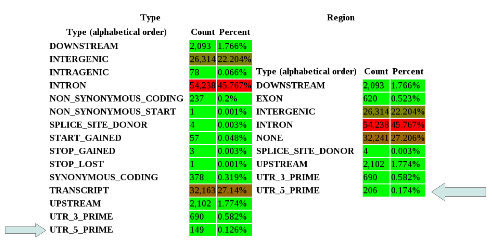

# Output summary Files

SnpEff creates an additional output file showing overall statistics.
This "stats" file is an HTML file which can be opened using a web browser.
You can find an example of a 'stats' file [here](adds/1kg.html).

### HTML summary (snpEff_summary.html)

The program performs some statistics and saves them to the file 'snpEff_summary.html' on the
directory where snpEff is being executed. You can see the file, by opening it in your browser.

!!! info
    You can change the default location by using the `-stats` command line option. This also changes the location of the TXT summary file.

!!! info
    Summary can be create in CSV format using command line option `-csvStats`. This allows easy downstream processing.

E.g.: In the stats file, you can see coverage histogram plots like this one:


**"Effects by type" vs "Effects by region"**

SnpEff annotates variants.
Variants produce effect of difference "types" (e.g. NON_SYNONYMOUS_CODING, STOP_GAINED).
These variants affect regions of the genome (e.g. EXON, INTRON).
The two tables count how many effects for each type and for each region exists.

E.g.: In an EXON region, you can have all the following effect types: NON_SYNONYMOUS_CODING, SYNONYMOUS_CODING, FRAME_SHIFT, STOP_GAINED, etc.

The complicated part is that some effect types affect a region that has the same name (yes, I know, this is confusing).

E.g.: In a UTR_5_PRIME region you can have UTR_5_PRIME and START_GAINED effect type.

This means that the number of both tables are not exactly the same, because the labels don't mean the same.
See the next figure as an example:

{: .center}

So the number of effects that affect a UTR_5_PRIME *region* is 206. Of those, 57 are effects *type* START_GAINED and 149 are effects *type* UTR_5_PRIME.

How exactly are effect *type* and effect *region* related? See the following table:

Effect Type                                  | Region
-------------------------------------------- | ------
NONE<br>CHROMOSOME<br>CUSTOM<br>CDS          | NONE
INTERGENIC<br>INTERGENIC_CONSERVED           | INTERGENIC
UPSTREAM                                     | UPSTREAM
UTR_5_PRIME<br>UTR_5_DELETED<br>START_GAINED | UTR_5_PRIME
SPLICE_SITE_ACCEPTOR                         | SPLICE_SITE_ACCEPTOR
SPLICE_SITE_DONOR                            | SPLICE_SITE_DONOR
SPLICE_SITE_REGION                           | SPLICE_SITE_REGION
INTRAGENIC<br>START_LOST<br>SYNONYMOUS_START<br>NON_SYNONYMOUS_START<br>GENE<br>TRANSCRIPT | EXON or NONE
EXON<br>EXON_DELETED<br>NON_SYNONYMOUS_CODING<br>SYNONYMOUS_CODING<br>FRAME_SHIFT<br>CODON_CHANGE<br>CODON_INSERTION<br>CODON_CHANGE_PLUS_CODON_INSERTION<br>CODON_DELETION<br>CODON_CHANGE_PLUS_CODON_DELETION<br>STOP_GAINED<br>SYNONYMOUS_STOP<br> STOP_LOST<br>RARE_AMINO_ACID | EXON
INTRON<br>INTRON_CONSERVED                   | INTRON
UTR_3_PRIME<br>UTR_3_DELETED                 | UTR_3_PRIME
DOWNSTREAM                                   | DOWNSTREAM
REGULATION                                   | REGULATION

### Gene counts summary (snpEff_genes.txt)

SnpEff also generates a TXT (tab separated) file having counts of number of variants affecting each transcript and gene.
By default, the file name is `snpEff_genes.txt`, but it can be changed using the `-stats` command line option.

Here is an example of this file:
```
$ head snpEff_genes.txt
# The following table is formatted as tab separated values.
#GeneName	GeneId	TranscriptId	BioType	variants_impact_HIGH	variants_impact_LOW	variants_impact_MODERATE	variants_impact_MODIFIER	variants_effect_3_prime_UTR_variant	variants_effect_5_prime_UTR_premature_start_codon_gain_variant	variants_effect_5_prime_UTR_variant	variants_effect_downstream_gene_variant	variants_effect_intron_variant	variants_effect_missense_variant	variants_effect_non_coding_exon_variant	variants_effect_splice_acceptor_variant	variants_effect_splice_donor_variant	variants_effect_splice_region_variant	variants_effect_start_lost	variants_effect_stop_gained	variants_effect_stop_lost	variants_effect_synonymous_variant	variants_effect_upstream_gene_variant	bases_affected_DOWNSTREAM	total_score_DOWNSTREAM	length_DOWNSTREAM	bases_affected_EXON	total_score_EXON	length_EXON	bases_affected_INTRON	total_score_INTRON	length_INTRON	bases_affected_SPLICE_SITE_ACCEPTOR	total_score_SPLICE_SITE_ACCEPTOR	length_SPLICE_SITE_ACCEPTOR	bases_affected_SPLICE_SITE_DONOR	total_score_SPLICE_SITE_DONOR	length_SPLICE_SITE_DONOR	bases_affected_SPLICE_SITE_REGION	total_score_SPLICE_SITE_REGION	length_SPLICE_SITE_REGION	bases_affected_TRANSCRIPT	total_score_TRANSCRIPT	length_TRANSCRIPT	bases_affected_UPSTREAM	total_score_UPSTREAM	length_UPSTREAM	bases_affected_UTR_3_PRIME	total_score_UTR_3_PRIME	length_UTR_3_PRIME	bases_affected_UTR_5_PRIME	total_score_UTR_5_PRIME	length_UTR_5_PRIME
AC000029.1	ENSG00000221069	ENST00000408142	miRNA	0	0	0	2	0	0	0	2	0	0	0	0	0	0	0	0	5000	0	0	0	0	0	0	0	0	0	0	0	0	0	0	0	0	0	0	0	0	0	0	0
AC000068.5	ENSG00000185065	ENST00000431090	antisense	0	0	0	1	0	0	0	0	0	0	0	0	0	0	0	5000	0	0	0	0	0	0
AC000081.2	ENSG00000230194	ENST00000433141	processed_pseudogene	0	0	0	8	0	0	0	3	0	0	0	0	0	0	5000	0	0	0	0	0	0	0	0	0	0	0	0	0	0	0	0	0	0	5	0	5000	0	0
AC000089.3	ENSG00000235776	ENST00000424559	processed_pseudogene	0	0	0	1	0	0	0	0	0	0	0	0	0	0	5000	0	0	0	0	0	0
AC002472.1	ENSG00000269103	ENST00000547793	protein_coding	0	0	0	6	0	0	0	5	0	0	0	0	0	0	0	5000	0	0	0	0	0	0	0	0	0	0	0	0	0	0	0	0	0	0	1	0	5000	0	0
AC002472.11	ENSG00000226872	ENST00000450652	antisense	0	0	0	13	0	0	0	5	2	0	0	0	0	0	0	5000	0	0	0	2	0	11199	0	0	0	0	0	0	0	0	0	0	0	0	6	0	5000	0	0
AC002472.13	ENSG00000187905	ENST00000342608	protein_coding	0	1	6	1	0	0	0	0	1	6	0	0	0	1	0	116	1	0	934	0	0	0	0	0	0	1	0	3	0	0	0	0	0	0	0	0	0	0	0
AC002472.13	ENSG00000187905	ENST00000442047	protein_coding	0	1	6	1	0	0	0	0	1	6	0	0	0	1	0	116	1	0	934	0	0	0	0	0	0	1	0	3	0	0	0	0	0	0	0	0	0	0	0
```

The columns in this table are:

Column name        | Meaning
------------------ | ---------------
GeneName           | Gene name (usually HUGO)
GeneId             | Gene's ID
TranscriptId       | Transcript's ID
BioType            | Transcript's bio-type (if available)
&nbsp;             | **The following column is repeated for each impact {HIGH, MODERATE, LOW, MODIFIER}**
variants_impact_*  | Count number of variants for each impact category
&nbsp;             | **The following column is repeated for each annotated effect (e.g. missense_variant, synonymous_variant, stop_lost, etc.)**
 variants_effect_* | Count number of variants for each effect type
&nbsp;             | **The following columns are repeated for several genomic regions (DOWNSTREAM, EXON, INTRON, UPSTREAM, etc.)**
bases_affected_*   | Number of bases that variants overlap genomic region
total_score_*      | Sum of scores overlapping this genomic region. Note: Scores are only available when input files are type 'BED' (e.g. when annotating ChipSeq experiments)
length_*           | Genomic region length
